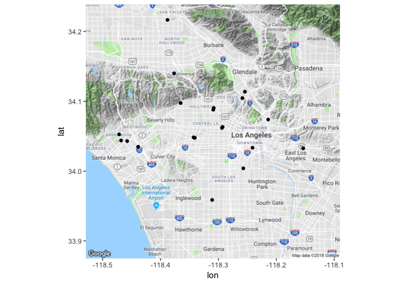

<!-- README.md is generated from README.Rmd. Please edit that file -->
yelp
====

This R package provides access to the [Yelp Fusion API, version 3](https://www.yelp.com/developers/documentation/v3).

Installation and setup
----------------------

To use this package, you must install it and get an access token for the API.

### Package installation

To install the package, you first need *remotes* installed.

``` r
install.packages("remotes")
```

``` r
remotes::install_github("richierocks/yelp")
```

### Getting the client ID and client secret

To gain access to the API, you have to [register with Yelp](https://www.yelp.com/signup), log in, and [create your own app](https://www.yelp.com/developers/v3/manage_app). This takes 5 to 10 minutes of pointing and clicking. It's reasonably self-explanatory, and there are more details on the [API Authentication](https://www.yelp.com/developers/documentation/v3/authentication) page.

Once you have registered, make a note of your *client ID* and *client secret*.

### Getting and storing an access token

You use the client ID and client secret to get an access token.

``` r
access_token <- get_access_token(client_id, client_secret)
```

This access token can be passed into individual calls to the API, or you can store it so the package will automatically find it. `store_access_token(access_token)` will store it for the R session, or you can use your operating system tools to set a `YELP_ACCESS_TOKEN` environment variable to store it permanently.

### Join the Developer Beta program

Some features such as business match and event search require you to sign up for the Yelp Developer Beta program. You can do this from the [Manage App](https://www.yelp.com/developers/v3/manage_app) page.

Usage
-----

To search for businesses close to a specific location, call `business_search()` with a string giving a search term and either a string describing a location or numbers giving latitude and longitude. The return value is a tibble (since it has a nicer print method for wider data frames) with one business per row.

``` r
library(yelp)
library(dplyr)
salons_in_la <- business_search("beauty salon", "los angeles")
glimpse(salons_in_la)
#> Observations: 20
#> Variables: 24
#> $ id               <chr> "7rc4Ctbh1WVm_RgqDYXPAg", "Z6ogx6ZNmeJ67K0ec9...
#> $ name             <chr> "M Hair & Beauty Salon", "Studio 21", "Hair S...
#> $ rating           <dbl> 5.0, 5.0, 4.5, 5.0, 5.0, 4.5, 4.5, 4.5, 5.0, ...
#> $ review_count     <int> 79, 33, 92, 14, 30, 19, 15, 261, 25, 58, 5, 2...
#> $ price            <chr> "$$", "$$", "$", "$$", "$$", "$", "$", "$$", ...
#> $ image_url        <chr> "https://s3-media3.fl.yelpcdn.com/bphoto/gGhw...
#> $ is_closed        <lgl> FALSE, FALSE, FALSE, FALSE, FALSE, FALSE, FAL...
#> $ url              <chr> "https://www.yelp.com/biz/m-hair-and-beauty-s...
#> $ category_aliases <list> [<"hair", "makeupartists">, "hair", "hair", ...
#> $ category_titles  <list> [<"Hair Salons", "Makeup Artists">, "Hair Sa...
#> $ latitude         <dbl> 34.06346, 34.03359, 34.04767, 34.03230, 34.06...
#> $ longitude        <dbl> -118.2928, -118.1899, -118.3235, -118.3433, -...
#> $ distance_m       <dbl> 2641.356, 12511.775, 1562.822, 3831.118, 1090...
#> $ transactions     <list> [<>, <>, <>, <>, <>, <>, <>, <>, <>, <>, <>,...
#> $ address1         <chr> "600 S New Hampshire Ave", "3673 E 3rd St", "...
#> $ address2         <chr> "Fl 2", "", "", "", "Ste 205", "", "", "", ""...
#> $ address3         <chr> "", "", "", "", "Madang Plaza Mall", "", "", ...
#> $ city             <chr> "Los Angeles", "Los Angeles", "Los Angeles", ...
#> $ zip_code         <chr> "90005", "90063", "90019", "90016", "90005", ...
#> $ state            <chr> "CA", "CA", "CA", "CA", "CA", "CA", "CA", "CA...
#> $ country          <chr> "US", "US", "US", "US", "US", "US", "US", "US...
#> $ display_address  <list> [<"600 S New Hampshire Ave", "Fl 2", "Los An...
#> $ phone            <chr> "+12137361890", "+15625762301", "+13237347099...
#> $ display_phone    <chr> "(213) 736-1890", "(562) 576-2301", "(323) 73...
```

The results include the longitude and latitude of each business, so you can use *ggmap* to plot their locations.

``` r
library(ggmap)
library(magrittr)
la <- salons_in_la %$%
  c(median(longitude), median(latitude))
la_map <- get_map(la, zoom = 11)
#> Map from URL : http://maps.googleapis.com/maps/api/staticmap?center=34.063093,-118.294609&zoom=11&size=640x640&scale=2&maptype=terrain&language=en-EN&sensor=false
(map_plot_of_salons_in_la <- ggmap(la_map) + 
  geom_point(aes(longitude, latitude), data = salons_in_la)
)
```



<!--


-->
Once you have spotted an interesting business, make a note of the business ID from the `id` column as it is required as an argument for several of the other functions.

``` r
arianna_hair_boutique_id <- salons_in_la %>% 
  filter(name == "Arianna Hair Boutique") %>% 
  pull(id)
```

You can use the business ID with the `business_lookup()` to get more detailed information about that business, including opening hours.

``` r
arianna_hair_boutique_details <- business_lookup(arianna_hair_boutique_id)
glimpse(arianna_hair_boutique_details)
#> Observations: 1
#> Variables: 28
#> $ id                    <chr> "4gV99Gc24G3ZGOwZfwPh4g"
#> $ name                  <chr> "Arianna Hair Boutique"
#> $ rating                <dbl> 4.5
#> $ review_count          <int> 261
#> $ price                 <chr> "$$"
#> $ image_url             <chr> "https://s3-media3.fl.yelpcdn.com/bphoto...
#> $ is_closed             <lgl> FALSE
#> $ url                   <chr> "https://www.yelp.com/biz/arianna-hair-b...
#> $ category_aliases      <list> [<"hair", "eyelashservice", "othersalon...
#> $ category_titles       <list> [<"Hair Salons", "Eyelash Service", "Na...
#> $ latitude              <dbl> 34.0619
#> $ longitude             <dbl> -118.2939
#> $ distance_m            <dbl> NA
#> $ transactions          <list> [<>]
#> $ address1              <chr> "3287 Wilshire Blvd"
#> $ address2              <chr> ""
#> $ address3              <chr> ""
#> $ city                  <chr> "Los Angeles"
#> $ zip_code              <chr> "90010"
#> $ state                 <chr> "CA"
#> $ country               <chr> "US"
#> $ display_address       <list> [<"3287 Wilshire Blvd", "Los Angeles, C...
#> $ phone                 <chr> "+12137360481"
#> $ display_phone         <chr> "(213) 736-0481"
#> $ photos                <list> [["https://s3-media3.fl.yelpcdn.com/bph...
#> $ is_claimed            <lgl> TRUE
#> $ is_permanently_closed <lgl> FALSE
#> $ opening_hours         <list> [<# A tibble: 7 x 4,   start_day start_...
arianna_hair_boutique_details$opening_hours
#> [[1]]
#> # A tibble: 7 x 4
#>   start_day start_time end_day   end_time
#>   <chr>     <chr>      <chr>     <chr>   
#> 1 Monday    1000       Monday    2200    
#> 2 Tuesday   1000       Tuesday   2200    
#> 3 Wednesday 1000       Wednesday 2200    
#> 4 Thursday  1000       Thursday  2200    
#> 5 Friday    1000       Friday    2200    
#> 6 Saturday  1000       Saturday  2000    
#> 7 Sunday    1200       Sunday    1800
```

You can also use `reviews()` to get reviews of that business.

``` r
arianna_hair_boutique_reviews <- reviews(arianna_hair_boutique_id)
glimpse(arianna_hair_boutique_reviews)
#> Observations: 3
#> Variables: 7
#> $ id             <chr> "JG2r2Csjfxr3iAoXPgnVCQ", "MQK3Z_iBRvcmpDcliOV2...
#> $ rating         <int> 5, 4, 3
#> $ text           <chr> "First off they are the sweetest!!!  You'll be ...
#> $ time_created   <chr> "2018-03-17 22:43:17", "2018-01-19 16:11:09", "...
#> $ url            <chr> "https://www.yelp.com/biz/arianna-hair-boutique...
#> $ user_image_url <chr> "https://s3-media4.fl.yelpcdn.com/photo/aRaaysD...
#> $ user_name      <chr> "Jena Z.", "Ankita A.", "Chloe X."
```

These can be used with the [*tidytext*](https://cran.r-project.org/web/packages/tidytext) package to perform a sentiment analysis.

``` r
library(tidytext)
(arianna_hair_boutique_sentiments <- arianna_hair_boutique_reviews %>% 
  select(id, rating, text) %>% 
  unnest_tokens(word, text)%>% 
  anti_join(get_stopwords(), by = "word") %>% 
  inner_join(get_sentiments("bing"))
)
#> Joining, by = "word"
#> # A tibble: 5 x 4
#>   id                     rating word     sentiment
#>   <chr>                   <int> <chr>    <chr>    
#> 1 JG2r2Csjfxr3iAoXPgnVCQ      5 pampered positive 
#> 2 JG2r2Csjfxr3iAoXPgnVCQ      5 enjoy    positive 
#> 3 MQK3Z_iBRvcmpDcliOV2vw      4 loving   positive 
#> 4 1qHBrUMYrTeaF12QDk-rhg      3 damaged  negative 
#> 5 1qHBrUMYrTeaF12QDk-rhg      3 bad      negative
```

There are some other functions with more niche usage.

-   `phone_search()` lets you search for a business by phone number.
-   `autocomplete()`

Not yet implemented
-------------------

Several parts of the API aren't yet implemented in this package. In particular, none of the events API is implemented, nor is the transactions API. Business match doesn't work correctly.
